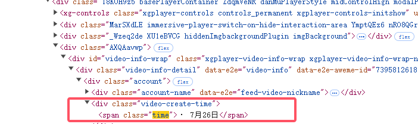

# 项目分析

## 一、命令解释

1 参数 平台/验证方式/动作类型
> python main.py --platform dy --lt qrcode --type search     

## 二、参数解析

示例单条result：

[{"aweme_id": "7395812618608315657", "aweme_type": "0", "title": "现在大学生毕业找工作有多难？ #大学生毕业现状 #大学生 #大学生就业 #记录真实生活 #我的打工日记", "desc": "现在大学生毕业找工作有多难？ #大学生毕业现状 #大学生 #大学生就业 #记录真实生活 #我的打工日记", "create_time": 1721971824, "user_id": "2522734387543443", "sec_uid": "MS4wLjABAAAA2vL9wCD0hY5c3bg744MXFOs3kBU8LsHrSUYEjEFnZnFf24KSGjPb7hbjN7QB2pQ0", "short_user_id": null, "user_unique_id": null, "user_signature": null, "nickname": "小于在路上👾", "avatar": "https://p3-pc.douyinpic.com/aweme/100x100/aweme-avatar/tos-cn-avt-0015_f640f433aa097aaedcaff22eee3793af.jpeg?from=327834062", "liked_count": "105354", "collected_count": "19466", "comment_count": "21540", "share_count": "68101", "ip_location": "", "last_modify_ts": 1726209379090, "aweme_url": "https://www.douyin.com/video/7395812618608315657", "source_keyword": "大学生找工作"}，{}，{}...]

- id: {"aweme_id": "7395812618608315657"}

- title:{"title": "现在大学生毕业找工作有多难？ #大学生毕业现状 #大学生 #大学生就业 #记录真实生活 #我的打工日记"}

- time:{ "create_time": 1721971824} 

- video_production : {"sec_uid": "MS4wLjABAAAA2vL9wCD0hY5c3bg744MXFOs3kBU8LsHrSUYEjEFnZnFf24KSGjPb7hbjN7QB2pQ0"}

- nick_name: {"nickname": "小于在路上👾"}

- 点击量：{"liked_count": "105354", }

- 收藏数：{"collected_count": "19466",}

- 评论数：{"comment_count": "21540", }

 
- 分享量：{"share_count": "68101", }

- userId:{"user_id": "2522734387543443"}
- avatar： {"avatar": "https://p3-pc.douyinpic.com/aweme/100x100/aweme-avatar/tos-cn-avt-0015_f640f433aa097aaedcaff22eee3793af.jpeg?from=327834062"}
- 视频链接：{"aweme_url": "https://www.douyin.com/video/7395812618608315657",}

## 三、Summary:

1 不同关键词爬取到的数据量不一样

2 同一关键词不同时间爬取到的数据量不一样

3 第一次登录扫码后会有缓存记录

4 在mysql中创建 数据库，修改配置文件,运行db.py文件

>D:\rkwork\project\crawler\MediaCrawler\config\db_config.py

>CREATE DATABASE media_crawler;
